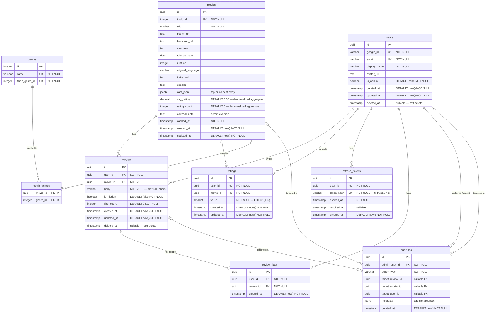

# Entity Relationship Diagram + Database Schema — Movie Review Application

**Document ID:** ERD-1.0
**Owner:** database-architect
**Status:** DRAFT — Awaiting Product Owner Sign-Off
**Version:** 1.0
**Date:** 2026-05-23
**Produced by:** database-architect (Phase 4 — Detailed Design)
**Reviewed by:** tech-lead

---

## Table of Contents

1. [Entity Relationship Diagram](#1-entity-relationship-diagram)
2. [Table Definitions](#2-table-definitions)
3. [Constraints Summary](#3-constraints-summary)
4. [Index Definitions](#4-index-definitions)
5. [Prisma Schema](#5-prisma-schema)
6. [Migration Strategy](#6-migration-strategy)
7. [Seed Data Plan](#7-seed-data-plan)

---

## 1. Entity Relationship Diagram



---

## 2. Table Definitions

### 2.1 `users`

Stores all registered user accounts. Google OAuth profile data only.

| Column | Type | Constraints | Notes |
|--------|------|-------------|-------|
| `id` | `uuid` | PK, DEFAULT gen_random_uuid() | Internal primary key |
| `google_id` | `varchar(255)` | NOT NULL, UNIQUE | Google OAuth `sub` claim |
| `email` | `varchar(255)` | NOT NULL, UNIQUE | From Google profile; not displayed in UI |
| `display_name` | `varchar(255)` | NOT NULL | From Google profile |
| `avatar_url` | `text` | nullable | Google profile picture URL |
| `is_admin` | `boolean` | NOT NULL, DEFAULT false | Admin privilege flag |
| `created_at` | `timestamptz` | NOT NULL, DEFAULT now() | Account creation timestamp |
| `updated_at` | `timestamptz` | NOT NULL, DEFAULT now() | Last profile update |
| `deleted_at` | `timestamptz` | nullable | GDPR soft-delete timestamp |

**Notes:**
- Soft-delete via `deleted_at`: user is considered deleted when this is non-null.
- All queries against `users` should include `WHERE deleted_at IS NULL` unless explicitly fetching deleted records.
- On account deletion: `deleted_at` set; all associated `reviews`, `ratings`, `refresh_tokens`, `review_flags` are hard-deleted via cascade.

---

### 2.2 `movies`

Local cache of TMDB movie metadata. One row per unique TMDB movie.

| Column | Type | Constraints | Notes |
|--------|------|-------------|-------|
| `id` | `uuid` | PK, DEFAULT gen_random_uuid() | Internal primary key |
| `tmdb_id` | `integer` | NOT NULL, UNIQUE | TMDB movie identifier |
| `title` | `varchar(500)` | NOT NULL | Movie title from TMDB |
| `poster_url` | `text` | nullable | Full TMDB image URL |
| `backdrop_url` | `text` | nullable | Full TMDB backdrop URL |
| `overview` | `text` | nullable | Synopsis from TMDB |
| `release_date` | `date` | nullable | TMDB release date |
| `runtime` | `integer` | nullable | Runtime in minutes |
| `original_language` | `varchar(10)` | nullable | ISO 639-1 language code |
| `trailer_url` | `text` | nullable | YouTube trailer URL via TMDB videos endpoint |
| `director` | `varchar(500)` | nullable | Director name(s) from TMDB credits |
| `cast_json` | `jsonb` | nullable | JSON array of `{name, character, profile_path}` — top 10 cast |
| `avg_rating` | `numeric(3,2)` | NOT NULL, DEFAULT 0.00 | Denormalized: arithmetic mean of all ratings |
| `rating_count` | `integer` | NOT NULL, DEFAULT 0 | Denormalized: count of all ratings |
| `editorial_note` | `text` | nullable | Admin-set custom note (FR-083) |
| `cached_at` | `timestamptz` | NOT NULL | When TMDB data was last fetched |
| `created_at` | `timestamptz` | NOT NULL, DEFAULT now() | When movie was first added |
| `updated_at` | `timestamptz` | NOT NULL, DEFAULT now() | Last local update |

**Notes:**
- `avg_rating` and `rating_count` are updated by a PostgreSQL trigger on `ratings` table INSERT/UPDATE/DELETE.
- `cached_at` is used by the TMDB sync service to identify stale entries (threshold: 24 hours).
- `cast_json` stores the top 10 billed cast to avoid a separate `cast` table for v1.0.

---

### 2.3 `genres`

TMDB genre reference table. Populated by seed migration.

| Column | Type | Constraints | Notes |
|--------|------|-------------|-------|
| `id` | `integer` | PK | Internal ID (matches TMDB genre ID for simplicity) |
| `name` | `varchar(100)` | NOT NULL, UNIQUE | Genre name (e.g., "Action") |
| `tmdb_genre_id` | `integer` | NOT NULL, UNIQUE | TMDB's genre ID |

---

### 2.4 `movie_genres`

Junction table for the many-to-many relationship between movies and genres.

| Column | Type | Constraints | Notes |
|--------|------|-------------|-------|
| `movie_id` | `uuid` | PK (composite), FK → movies(id) ON DELETE CASCADE | |
| `genre_id` | `integer` | PK (composite), FK → genres(id) ON DELETE CASCADE | |

---

### 2.5 `reviews`

User-submitted text reviews for movies.

| Column | Type | Constraints | Notes |
|--------|------|-------------|-------|
| `id` | `uuid` | PK, DEFAULT gen_random_uuid() | |
| `user_id` | `uuid` | NOT NULL, FK → users(id) ON DELETE CASCADE | Author |
| `movie_id` | `uuid` | NOT NULL, FK → movies(id) ON DELETE CASCADE | Subject movie |
| `body` | `varchar(500)` | NOT NULL, CHECK(length(trim(body)) > 0) | Review text; trimmed non-empty |
| `is_hidden` | `boolean` | NOT NULL, DEFAULT false | Admin soft-hide flag (FR-072) |
| `flag_count` | `integer` | NOT NULL, DEFAULT 0 | Denormalized count of active flags |
| `created_at` | `timestamptz` | NOT NULL, DEFAULT now() | |
| `updated_at` | `timestamptz` | NOT NULL, DEFAULT now() | Updated on edit |
| `deleted_at` | `timestamptz` | nullable | Soft-delete (admin permanent hide; user deletion cascades from users table) |

**Constraints:**
- `UNIQUE(user_id, movie_id)` — one review per user per movie.
- `CHECK(char_length(body) <= 500)` — server-side enforcement of 500-char limit.
- `CHECK(length(trim(body)) > 0)` — reject blank/whitespace reviews.

**Public visibility rule:** A review is publicly visible when `is_hidden = false AND deleted_at IS NULL`.

---

### 2.6 `ratings`

User star ratings for movies. One rating per user per movie.

| Column | Type | Constraints | Notes |
|--------|------|-------------|-------|
| `id` | `uuid` | PK, DEFAULT gen_random_uuid() | |
| `user_id` | `uuid` | NOT NULL, FK → users(id) ON DELETE CASCADE | Rater |
| `movie_id` | `uuid` | NOT NULL, FK → movies(id) ON DELETE CASCADE | Rated movie |
| `value` | `smallint` | NOT NULL, CHECK(value >= 1 AND value <= 5) | Star value 1-5 |
| `created_at` | `timestamptz` | NOT NULL, DEFAULT now() | |
| `updated_at` | `timestamptz` | NOT NULL, DEFAULT now() | Updated on change |

**Constraints:**
- `UNIQUE(user_id, movie_id)` — one rating per user per movie (upsert on conflict).

---

### 2.7 `refresh_tokens`

Hashed refresh tokens for JWT rotation. Replaces in-memory session store.

| Column | Type | Constraints | Notes |
|--------|------|-------------|-------|
| `id` | `uuid` | PK, DEFAULT gen_random_uuid() | |
| `user_id` | `uuid` | NOT NULL, FK → users(id) ON DELETE CASCADE | Token owner |
| `token_hash` | `varchar(64)` | NOT NULL, UNIQUE | SHA-256 hex of the raw refresh token |
| `expires_at` | `timestamptz` | NOT NULL | Expiry = issuance + 7 days |
| `revoked_at` | `timestamptz` | nullable | Set on sign-out or rotation |
| `created_at` | `timestamptz` | NOT NULL, DEFAULT now() | |

**Notes:**
- The raw token is never stored; only the SHA-256 hash.
- On token rotation: old row gets `revoked_at = now()`, new row inserted.
- Expired + revoked rows are cleaned up by a scheduled job (weekly).

---

### 2.8 `review_flags`

User-submitted flags marking a review as inappropriate.

| Column | Type | Constraints | Notes |
|--------|------|-------------|-------|
| `id` | `uuid` | PK, DEFAULT gen_random_uuid() | |
| `user_id` | `uuid` | NOT NULL, FK → users(id) ON DELETE CASCADE | Flagger |
| `review_id` | `uuid` | NOT NULL, FK → reviews(id) ON DELETE CASCADE | Flagged review |
| `created_at` | `timestamptz` | NOT NULL, DEFAULT now() | |

**Constraints:**
- `UNIQUE(user_id, review_id)` — one flag per user per review.

**Note:** When a flag is inserted, a trigger increments `reviews.flag_count`. When deleted (unflag or review deleted), decrements `reviews.flag_count`.

---

### 2.9 `audit_log`

Append-only log of admin-initiated actions. Never updated; never deleted.

| Column | Type | Constraints | Notes |
|--------|------|-------------|-------|
| `id` | `uuid` | PK, DEFAULT gen_random_uuid() | |
| `admin_user_id` | `uuid` | NOT NULL, FK → users(id) — no cascade | Admin who acted; kept even if admin account deleted |
| `action_type` | `varchar(50)` | NOT NULL | See action type enum below |
| `target_review_id` | `uuid` | nullable, FK → reviews(id) — no cascade | Targeted review |
| `target_movie_id` | `uuid` | nullable, FK → movies(id) — no cascade | Targeted movie |
| `target_user_id` | `uuid` | nullable, FK → users(id) — no cascade | Targeted user |
| `metadata` | `jsonb` | nullable | Additional context (e.g., old values) |
| `created_at` | `timestamptz` | NOT NULL, DEFAULT now() | Action timestamp |

**Action Type Enum (stored as varchar):**
- `REVIEW_DELETED` — admin hard-deleted a review
- `REVIEW_HIDDEN` — admin soft-hid a review
- `REVIEW_RESTORED` — admin restored a hidden review
- `MOVIE_ADDED` — admin added a movie from TMDB
- `MOVIE_UPDATED` — admin edited movie details
- `MOVIE_DELETED` — admin deleted a movie
- `MOVIE_SYNCED` — admin triggered TMDB metadata refresh
- `USER_PROMOTED` — admin granted admin role to user
- `USER_DEMOTED` — admin revoked admin role from user

**Note:** Foreign keys on `audit_log` use `ON DELETE SET NULL` (not cascade) so the log entry is preserved even after the target entity is deleted.

---

## 3. Constraints Summary

### Primary Keys

All tables use `uuid` PKs generated by `gen_random_uuid()` (PostgreSQL built-in).

### Unique Constraints

| Table | Columns | Notes |
|-------|---------|-------|
| `users` | `google_id` | One account per Google identity |
| `users` | `email` | Unique email |
| `movies` | `tmdb_id` | One local record per TMDB movie |
| `genres` | `name` | Unique genre name |
| `genres` | `tmdb_genre_id` | Unique TMDB genre ID |
| `reviews` | `(user_id, movie_id)` | One review per user per movie |
| `ratings` | `(user_id, movie_id)` | One rating per user per movie |
| `refresh_tokens` | `token_hash` | Unique token hashes |
| `review_flags` | `(user_id, review_id)` | One flag per user per review |

### Check Constraints

| Table | Constraint | Validates |
|-------|-----------|-----------|
| `reviews` | `CHECK(char_length(body) <= 500)` | 500-char limit |
| `reviews` | `CHECK(length(trim(body)) > 0)` | Non-blank body |
| `ratings` | `CHECK(value >= 1 AND value <= 5)` | Valid star range |
| `movies` | `CHECK(avg_rating >= 0 AND avg_rating <= 5)` | Valid aggregate |
| `movies` | `CHECK(rating_count >= 0)` | Non-negative count |

### Foreign Keys with Cascade Behavior

| Child Table | FK Column | Parent | On Delete | Rationale |
|------------|-----------|--------|-----------|-----------|
| `reviews` | `user_id` | `users(id)` | CASCADE | GDPR erasure deletes user's reviews |
| `reviews` | `movie_id` | `movies(id)` | CASCADE | Removing movie removes its reviews |
| `ratings` | `user_id` | `users(id)` | CASCADE | GDPR erasure deletes user's ratings |
| `ratings` | `movie_id` | `movies(id)` | CASCADE | Removing movie removes its ratings |
| `refresh_tokens` | `user_id` | `users(id)` | CASCADE | Deleting user revokes all tokens |
| `review_flags` | `user_id` | `users(id)` | CASCADE | Deleting user removes their flags |
| `review_flags` | `review_id` | `reviews(id)` | CASCADE | Deleting review removes its flags |
| `movie_genres` | `movie_id` | `movies(id)` | CASCADE | |
| `movie_genres` | `genre_id` | `genres(id)` | CASCADE | |
| `audit_log` | `admin_user_id` | `users(id)` | SET NULL | Preserve audit history |
| `audit_log` | `target_review_id` | `reviews(id)` | SET NULL | Preserve audit history |
| `audit_log` | `target_movie_id` | `movies(id)` | SET NULL | Preserve audit history |
| `audit_log` | `target_user_id` | `users(id)` | SET NULL | Preserve audit history |

---

## 4. Index Definitions

### 4.1 Covering Query Patterns

| Query Pattern | Table | Index | Type | Notes |
|--------------|-------|-------|------|-------|
| Fetch reviews for a movie (newest first) | `reviews` | `idx_reviews_movie_id_created_at` | B-tree on `(movie_id, created_at DESC)` | Covers detail page review list |
| Fetch reviews by a user (profile page) | `reviews` | `idx_reviews_user_id_created_at` | B-tree on `(user_id, created_at DESC)` | Profile page review list |
| Movie search by title (partial match) | `movies` | `idx_movies_title_trgm` | GIN trigram on `title` | Requires `pg_trgm` extension; enables `ILIKE '%query%'` |
| Movie lookup by TMDB ID (cache upsert) | `movies` | `idx_movies_tmdb_id` (unique) | B-tree on `tmdb_id` | Already unique constraint; explicit index for clarity |
| User lookup by Google ID (auth flow) | `users` | `idx_users_google_id` (unique) | B-tree on `google_id` | OAuth upsert lookup |
| User lookup by email | `users` | `idx_users_email` (unique) | B-tree on `email` | Dedup check |
| Refresh token validation | `refresh_tokens` | `idx_refresh_tokens_hash` (unique) | B-tree on `token_hash` | Auth hot path |
| Admin moderation queue (unflagged vs flagged) | `reviews` | `idx_reviews_flag_count_created_at` | B-tree on `(flag_count DESC, created_at DESC)` | Moderation queue sort |
| Admin moderation queue (hidden reviews) | `reviews` | `idx_reviews_is_hidden_created_at` | B-tree on `(is_hidden, created_at DESC)` | Filter hidden reviews |
| Ratings by movie (aggregate recalc, user lookup) | `ratings` | `idx_ratings_movie_id` | B-tree on `movie_id` | Aggregate recalculation |
| User's own rating for a movie | `ratings` | `idx_ratings_user_id_movie_id` (unique) | B-tree on `(user_id, movie_id)` | Already unique constraint |
| Movies by genre (browse filter) | `movie_genres` | `idx_movie_genres_genre_id` | B-tree on `genre_id` | Genre filter on browse |
| Active refresh tokens per user (cleanup) | `refresh_tokens` | `idx_refresh_tokens_user_id` | B-tree on `user_id` | User token cleanup |
| Stale movie cache detection | `movies` | `idx_movies_cached_at` | B-tree on `cached_at` | Background refresh job |
| Audit log by admin | `audit_log` | `idx_audit_log_admin_user_id` | B-tree on `admin_user_id` | Admin action history |
| Audit log chronological | `audit_log` | `idx_audit_log_created_at` | B-tree on `created_at DESC` | Log browsing |

### 4.2 Additional Notes

- `pg_trgm` extension must be enabled in the initial migration: `CREATE EXTENSION IF NOT EXISTS pg_trgm;`
- All UUID primary keys automatically have a B-tree index via the PK constraint.
- Composite unique constraints (`reviews(user_id, movie_id)`, `ratings(user_id, movie_id)`, `review_flags(user_id, review_id)`) automatically create unique indexes.
- Movie browse sorted by `avg_rating DESC` uses the column on `movies` directly — no separate index needed as the column is on the main table and queries are paginated.

---

## 5. Prisma Schema

```prisma
// prisma/schema.prisma
// Movie Review Application — Database Schema
// Generated for: database-architect Phase 4, 2026-05-23

generator client {
  provider = "prisma-client-js"
}

datasource db {
  provider = "postgresql"
  url      = env("DATABASE_URL")
}

// ─────────────────────────────────────────
// USERS
// ─────────────────────────────────────────

model User {
  id          String    @id @default(dbgenerated("gen_random_uuid()")) @db.Uuid
  googleId    String    @unique @map("google_id") @db.VarChar(255)
  email       String    @unique @db.VarChar(255)
  displayName String    @map("display_name") @db.VarChar(255)
  avatarUrl   String?   @map("avatar_url")
  isAdmin     Boolean   @default(false) @map("is_admin")
  createdAt   DateTime  @default(now()) @map("created_at") @db.Timestamptz
  updatedAt   DateTime  @updatedAt @map("updated_at") @db.Timestamptz
  deletedAt   DateTime? @map("deleted_at") @db.Timestamptz

  reviews       Review[]
  ratings       Rating[]
  refreshTokens RefreshToken[]
  reviewFlags   ReviewFlag[]
  auditLogs     AuditLog[]     @relation("AdminActions")

  @@index([googleId], name: "idx_users_google_id")
  @@index([email], name: "idx_users_email")
  @@map("users")
}

// ─────────────────────────────────────────
// MOVIES
// ─────────────────────────────────────────

model Movie {
  id               String    @id @default(dbgenerated("gen_random_uuid()")) @db.Uuid
  tmdbId           Int       @unique @map("tmdb_id")
  title            String    @db.VarChar(500)
  posterUrl        String?   @map("poster_url")
  backdropUrl      String?   @map("backdrop_url")
  overview         String?
  releaseDate      DateTime? @map("release_date") @db.Date
  runtime          Int?
  originalLanguage String?   @map("original_language") @db.VarChar(10)
  trailerUrl       String?   @map("trailer_url")
  director         String?   @db.VarChar(500)
  castJson         Json?     @map("cast_json")
  avgRating        Decimal   @default(0.00) @map("avg_rating") @db.Decimal(3, 2)
  ratingCount      Int       @default(0) @map("rating_count")
  editorialNote    String?   @map("editorial_note")
  cachedAt         DateTime  @map("cached_at") @db.Timestamptz
  createdAt        DateTime  @default(now()) @map("created_at") @db.Timestamptz
  updatedAt        DateTime  @updatedAt @map("updated_at") @db.Timestamptz

  genres      MovieGenre[]
  reviews     Review[]
  ratings     Rating[]
  auditLogs   AuditLog[]   @relation("MovieActions")

  @@index([tmdbId], name: "idx_movies_tmdb_id")
  @@index([cachedAt], name: "idx_movies_cached_at")
  @@map("movies")
}

// ─────────────────────────────────────────
// GENRES
// ─────────────────────────────────────────

model Genre {
  id          Int    @id
  name        String @unique @db.VarChar(100)
  tmdbGenreId Int    @unique @map("tmdb_genre_id")

  movies MovieGenre[]

  @@map("genres")
}

model MovieGenre {
  movieId String @map("movie_id") @db.Uuid
  genreId Int    @map("genre_id")

  movie Movie @relation(fields: [movieId], references: [id], onDelete: Cascade)
  genre Genre @relation(fields: [genreId], references: [id], onDelete: Cascade)

  @@id([movieId, genreId])
  @@index([genreId], name: "idx_movie_genres_genre_id")
  @@map("movie_genres")
}

// ─────────────────────────────────────────
// REVIEWS
// ─────────────────────────────────────────

model Review {
  id        String    @id @default(dbgenerated("gen_random_uuid()")) @db.Uuid
  userId    String    @map("user_id") @db.Uuid
  movieId   String    @map("movie_id") @db.Uuid
  body      String    @db.VarChar(500)
  isHidden  Boolean   @default(false) @map("is_hidden")
  flagCount Int       @default(0) @map("flag_count")
  createdAt DateTime  @default(now()) @map("created_at") @db.Timestamptz
  updatedAt DateTime  @updatedAt @map("updated_at") @db.Timestamptz
  deletedAt DateTime? @map("deleted_at") @db.Timestamptz

  user        User         @relation(fields: [userId], references: [id], onDelete: Cascade)
  movie       Movie        @relation(fields: [movieId], references: [id], onDelete: Cascade)
  flags       ReviewFlag[]
  auditLogs   AuditLog[]   @relation("ReviewActions")

  @@unique([userId, movieId], name: "uq_reviews_user_movie")
  @@index([movieId, createdAt(sort: Desc)], name: "idx_reviews_movie_id_created_at")
  @@index([userId, createdAt(sort: Desc)], name: "idx_reviews_user_id_created_at")
  @@index([flagCount(sort: Desc), createdAt(sort: Desc)], name: "idx_reviews_flag_count_created_at")
  @@index([isHidden, createdAt(sort: Desc)], name: "idx_reviews_is_hidden_created_at")
  @@map("reviews")
}

// ─────────────────────────────────────────
// RATINGS
// ─────────────────────────────────────────

model Rating {
  id        String   @id @default(dbgenerated("gen_random_uuid()")) @db.Uuid
  userId    String   @map("user_id") @db.Uuid
  movieId   String   @map("movie_id") @db.Uuid
  value     Int      @db.SmallInt
  createdAt DateTime @default(now()) @map("created_at") @db.Timestamptz
  updatedAt DateTime @updatedAt @map("updated_at") @db.Timestamptz

  user  User  @relation(fields: [userId], references: [id], onDelete: Cascade)
  movie Movie @relation(fields: [movieId], references: [id], onDelete: Cascade)

  @@unique([userId, movieId], name: "uq_ratings_user_movie")
  @@index([movieId], name: "idx_ratings_movie_id")
  @@map("ratings")
}

// ─────────────────────────────────────────
// REFRESH TOKENS
// ─────────────────────────────────────────

model RefreshToken {
  id        String    @id @default(dbgenerated("gen_random_uuid()")) @db.Uuid
  userId    String    @map("user_id") @db.Uuid
  tokenHash String    @unique @map("token_hash") @db.VarChar(64)
  expiresAt DateTime  @map("expires_at") @db.Timestamptz
  revokedAt DateTime? @map("revoked_at") @db.Timestamptz
  createdAt DateTime  @default(now()) @map("created_at") @db.Timestamptz

  user User @relation(fields: [userId], references: [id], onDelete: Cascade)

  @@index([tokenHash], name: "idx_refresh_tokens_hash")
  @@index([userId], name: "idx_refresh_tokens_user_id")
  @@map("refresh_tokens")
}

// ─────────────────────────────────────────
// REVIEW FLAGS
// ─────────────────────────────────────────

model ReviewFlag {
  id        String   @id @default(dbgenerated("gen_random_uuid()")) @db.Uuid
  userId    String   @map("user_id") @db.Uuid
  reviewId  String   @map("review_id") @db.Uuid
  createdAt DateTime @default(now()) @map("created_at") @db.Timestamptz

  user   User   @relation(fields: [userId], references: [id], onDelete: Cascade)
  review Review @relation(fields: [reviewId], references: [id], onDelete: Cascade)

  @@unique([userId, reviewId], name: "uq_review_flags_user_review")
  @@map("review_flags")
}

// ─────────────────────────────────────────
// AUDIT LOG
// ─────────────────────────────────────────

model AuditLog {
  id             String    @id @default(dbgenerated("gen_random_uuid()")) @db.Uuid
  adminUserId    String    @map("admin_user_id") @db.Uuid
  actionType     String    @map("action_type") @db.VarChar(50)
  targetReviewId String?   @map("target_review_id") @db.Uuid
  targetMovieId  String?   @map("target_movie_id") @db.Uuid
  targetUserId   String?   @map("target_user_id") @db.Uuid
  metadata       Json?
  createdAt      DateTime  @default(now()) @map("created_at") @db.Timestamptz

  adminUser    User    @relation("AdminActions", fields: [adminUserId], references: [id])
  targetReview Review? @relation("ReviewActions", fields: [targetReviewId], references: [id])
  targetMovie  Movie?  @relation("MovieActions", fields: [targetMovieId], references: [id])
  targetUser   User?   @relation("UserActions", fields: [targetUserId], references: [id])

  @@index([adminUserId], name: "idx_audit_log_admin_user_id")
  @@index([createdAt(sort: Desc)], name: "idx_audit_log_created_at")
  @@map("audit_log")
}
```

### 5.1 PostgreSQL Triggers (Raw SQL — applied via custom migration)

```sql
-- Trigger: update movies.avg_rating and movies.rating_count after ratings change
CREATE OR REPLACE FUNCTION update_movie_rating_aggregate()
RETURNS TRIGGER AS $$
BEGIN
  UPDATE movies
  SET
    avg_rating   = COALESCE((SELECT AVG(value)::numeric(3,2) FROM ratings WHERE movie_id = COALESCE(NEW.movie_id, OLD.movie_id)), 0.00),
    rating_count = (SELECT COUNT(*) FROM ratings WHERE movie_id = COALESCE(NEW.movie_id, OLD.movie_id)),
    updated_at   = now()
  WHERE id = COALESCE(NEW.movie_id, OLD.movie_id);
  RETURN NULL;
END;
$$ LANGUAGE plpgsql;

CREATE TRIGGER trg_ratings_aggregate
AFTER INSERT OR UPDATE OR DELETE ON ratings
FOR EACH ROW EXECUTE FUNCTION update_movie_rating_aggregate();

-- Trigger: update reviews.flag_count after review_flags change
CREATE OR REPLACE FUNCTION update_review_flag_count()
RETURNS TRIGGER AS $$
BEGIN
  IF TG_OP = 'INSERT' THEN
    UPDATE reviews SET flag_count = flag_count + 1, updated_at = now()
    WHERE id = NEW.review_id;
  ELSIF TG_OP = 'DELETE' THEN
    UPDATE reviews SET flag_count = GREATEST(flag_count - 1, 0), updated_at = now()
    WHERE id = OLD.review_id;
  END IF;
  RETURN NULL;
END;
$$ LANGUAGE plpgsql;

CREATE TRIGGER trg_review_flags_count
AFTER INSERT OR DELETE ON review_flags
FOR EACH ROW EXECUTE FUNCTION update_review_flag_count();

-- Enable pg_trgm for full-text movie title search
CREATE EXTENSION IF NOT EXISTS pg_trgm;

-- Trigram index for movie title search (ILIKE)
CREATE INDEX IF NOT EXISTS idx_movies_title_trgm ON movies USING GIN (title gin_trgm_ops);
```

---

## 6. Migration Strategy

### 6.1 Numbered Migration File Plan

All migrations are managed by Prisma Migrate. Custom SQL (triggers, extensions) is applied via `prisma/migrations/*/migration.sql` files with hand-edited additions.

| Migration # | File Name | Contents |
|------------|-----------|---------|
| 001 | `20260523000001_initial_schema` | Enable `pg_trgm`; create all tables (`users`, `movies`, `genres`, `movie_genres`, `reviews`, `ratings`, `refresh_tokens`, `review_flags`, `audit_log`) with all constraints |
| 002 | `20260523000002_indexes` | Create all non-PK, non-unique indexes (B-tree and GIN trigram indexes listed in Section 4) |
| 003 | `20260523000003_triggers` | Create `update_movie_rating_aggregate()` function + `trg_ratings_aggregate` trigger; create `update_review_flag_count()` function + `trg_review_flags_count` trigger |
| 004 | `20260523000004_seed_genres` | Insert all 19 TMDB genre rows (see Section 7.1) |
| 005 | `20260523000005_seed_movies` (optional) | Insert 5–10 sample movies for development/demo environment |

### 6.2 Migration Execution Strategy

1. **Development:** `npx prisma migrate dev` — applies migrations and regenerates Prisma Client.
2. **Production (initial deploy):** `npx prisma migrate deploy` — applies all pending migrations without regenerating client. Run as part of Docker Compose entrypoint for the backend service.
3. **Production (ongoing):** New migrations added to source control, applied at next deploy via `prisma migrate deploy` in CI/CD pipeline.
4. **Rollback:** Prisma Migrate does not auto-rollback. Each migration's inverse SQL must be written and applied manually if needed. This is acceptable for v1.0 home-server deployment.

### 6.3 Environment Matrix

| Environment | Migration Command | Seed Data |
|-------------|-------------------|-----------|
| Local dev | `prisma migrate dev` | Genres + sample movies |
| CI test | `prisma migrate deploy` | Genres only |
| Production | `prisma migrate deploy` | Genres only |

---

## 7. Seed Data Plan

### 7.1 Genres Seed (Migration 004)

All 19 official TMDB movie genres:

```sql
INSERT INTO genres (id, name, tmdb_genre_id) VALUES
  (28,    'Action',            28),
  (12,    'Adventure',         12),
  (16,    'Animation',         16),
  (35,    'Comedy',            35),
  (80,    'Crime',             80),
  (99,    'Documentary',       99),
  (18,    'Drama',             18),
  (10751, 'Family',            10751),
  (14,    'Fantasy',           14),
  (36,    'History',           36),
  (27,    'Horror',            27),
  (10402, 'Music',             10402),
  (9648,  'Mystery',           9648),
  (10749, 'Romance',           10749),
  (878,   'Science Fiction',   878),
  (10770, 'TV Movie',          10770),
  (53,    'Thriller',          53),
  (10752, 'War',               10752),
  (37,    'Western',           37)
ON CONFLICT (tmdb_genre_id) DO NOTHING;
```

### 7.2 Sample Movies Seed (Migration 005 — Dev/Demo Only)

5 well-known movies to populate a development environment for frontend/design verification. These are real TMDB entries:

| TMDB ID | Title | Release Year |
|---------|-------|-------------|
| 550 | Fight Club | 1999 |
| 278 | The Shawshank Redemption | 1994 |
| 238 | The Godfather | 1972 |
| 155 | The Dark Knight | 2008 |
| 13 | Forrest Gump | 1994 |

Full metadata for these entries will be fetched from TMDB during the first application startup (TMDB sync service) and the `movies` rows will be populated with full detail at that time. The seed inserts only the minimal required fields (`tmdb_id`, `title`, `cached_at`).

### 7.3 Admin User

The first admin account is not seeded via migration. The Product Owner logs in via Google OAuth (creating a regular user account), then the `is_admin` flag is set to `true` directly in the database via a one-time SQL command documented in the deployment runbook:

```sql
UPDATE users SET is_admin = true WHERE email = 'rawaldinesh13@dsu.ac.kr';
```

---

*Produced by database-architect — 2026-05-23*
*Reviewed by tech-lead — 2026-05-23*
